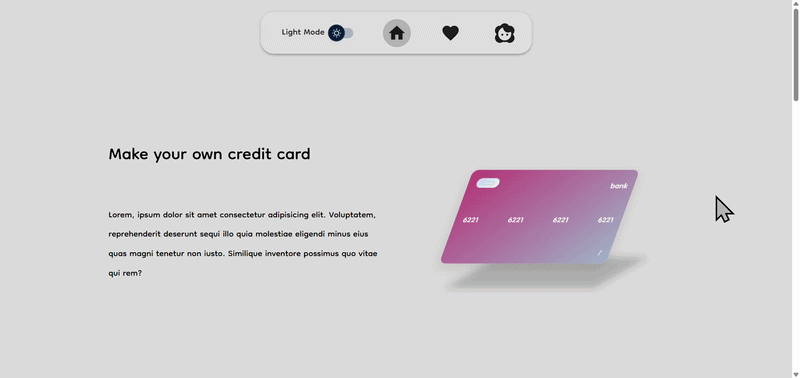

# MUI
<p align="center">
  
  
</p>

<p align="center">
  
</p>


A React project built to explore and practice Material UI (MUI) through a real-world interface.

## Demo

Live demo:
[](https://muiprivate.vercel.app/)

**Preview**


---

## About

This project was created as a hands-on way to learn and experiment with Material UI (MUI), its component system, styling architecture, and design patterns.

To make the learning process practical, I built a credit card customizer that allows users to modify card colors, numbers, and visual elements in real time.

The backend will be implemented later using Django.

---

## Tech Stack

* React
* Material UI (MUI)
* Vite
* Django (planned)

---

## Requirements

Before running the project locally, make sure you have:

* Node.js 18+
* npm or yarn

---

## Installation

Clone the repository:

```bash
git clone https://github.com/NiushaEbrahimi/MUI.git
cd MUI
```

Install dependencies:

```bash
npm install
```

Start the development server:

```bash
npm run dev
```

---

## Roadmap

* [x] Badge for Favorite
* [ ] form improvments (theme and numbers inputing)
* [ ] info in EachCard component
* [ ] improving responsive

---

## License

This project is intended for learning and experimentation.
